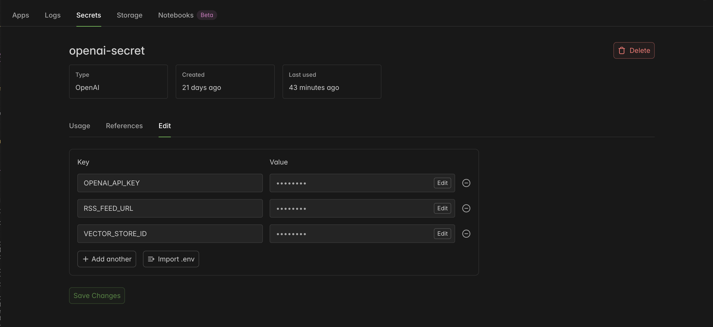
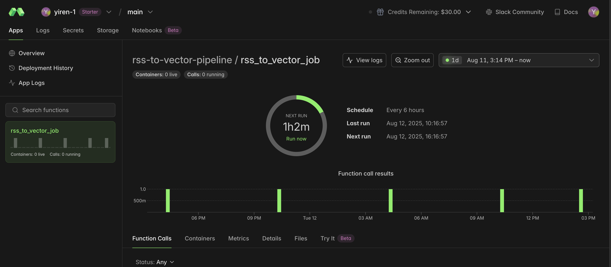
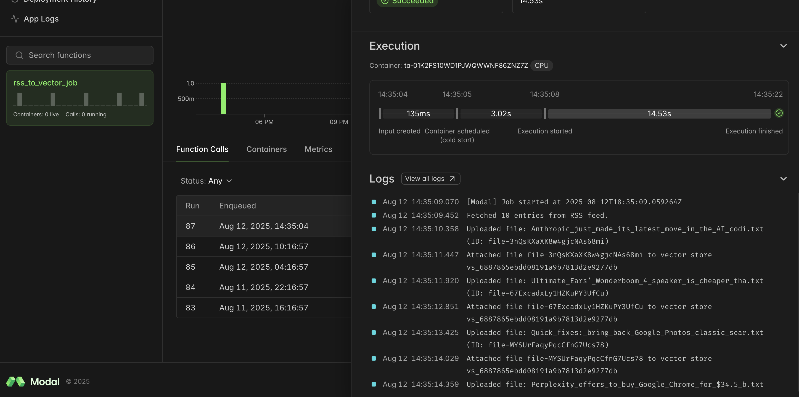

# Preparing Your Data Source

This repo helps your team choose and prepare the right retrieval strategy for your content before you stand up the MCP server.

---

## For Structured Data (SQL/API)

If your content lives in a database or is accessible via an API, your MCP server's `search` endpoint can query that source directly. You’ll translate MCP search requests into SQL queries or API calls and map results to the MCP `search` format. Your `fetch` endpoint will retrieve a single record’s full details.

---

## For Unstructured Documents (Vector Store or Search Index)

If you have large amounts of articles or documents (e.g., from RSS or CMS), you’ll need to index them in a search‑optimized datastore like a vector store or Elasticsearch. The MCP `search` endpoint will query this store, and `fetch` will return previews or full content based on entitlements.

We’ve built a **full example ingestion pipeline** using [Modal](https://modal.com/), a serverless compute platform that lets you run Python functions in the cloud without setting up infrastructure. The great thing about Modal is that, because it’s serverless, you **only pay for compute while the function is actually running** — making it perfect for cron jobs that run every few hours instead of continuously.

This ingestion pipeline takes a RSS feed (make sure that your RSS feed provides the full text of the articles), parses out the text content, converts the text content into vector embeddings, and indexes them in OpenAI's [vector store](https://platform.openai.com/docs/api-reference/vector-stores). You can further modify the code to ingest from other data sources, for example a CMS system.

To learn more about the process of turning text files into embedded vectors ready for file search, read [here](https://platform.openai.com/docs/guides/retrieval).

---

### Step‑by‑Step: Example Ingestion with Modal

1. **Clone the ingestion repo**:

```bash
git clone org-14957082@github.com:openai/mcp-in-a-box.git
cd mcp-in-a-box/python-rss-data-pipeline
```

2. **Install required packages**:

```bash
pip install -r requirements.txt
```

3. **Create a vector store** via the OpenAI API and note the `VECTOR_STORE_ID` returned.

   Prerequisite: this script reads your OpenAI key from the `OPENAI_API_KEY` environment variable.

```bash
# macOS / Linux
export OPENAI_API_KEY="<your_openai_api_key>"

python create_vector_store.py
```

4. **Create a Modal account** at [modal.com](https://modal.com/)

5. **Authenticate with Modal**:

```bash
modal setup
# or
python -m modal setup
```

6. **Set environment variables in Modal dashboard**

    - In the Modal web dashboard, navigate to *Secrets*.
    - Create a new secret named `openai-secret` that contains several keys:
        - `OPENAI_API_KEY`
        - `RSS_FEED_URL` (can use The Verge's: `https://www.theverge.com/rss/index.xml`)
        - `VECTOR_STORE_ID`
        - any other required variables (e.g., `CMS_API_KEY`).
    - This makes the variables available to your deployed functions in Modal.




7. **Adjust parameters** in `python-rss-data-pipeline/rss_to_vector.py` to change upload cadence. By default, it uploads every 6 hours.



```python
@app.function(schedule=modal.Period(hours=6)...
```
        
8. **Deploy the remote cron job**:

```bash
# Recommended (works even if the `modal` CLI shim isn't on PATH)
python -m modal deploy rss_to_vector.py

# Or, if the `modal` CLI command is available:
modal deploy rss_to_vector.py
```

9. **Trigger the pipeline manually** to test:

```bash
python trigger_rss_pipeline.py
```

Check logs in the [modal.com/dashboard](http://modal.com/dashboard) to confirm files are uploaded to the vector store.



---

Once your data is indexed, you’re ready to connect it to your MCP server implementation.
